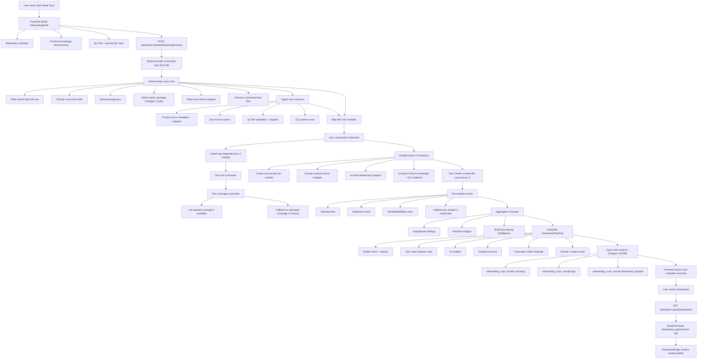

# Onboarding Initial Scan

This document explains the current Initial Scan workflow used after a user connects GitHub, selects a repository, adds Product Knowledge, and imports QC test cases.

Guardrail uses deterministic repository evidence first, then asks the Thinker model to reason over that evidence. The final dashboard is built by backend code and saved to Postgres.

## Goal

Initial Scan builds the first testing intelligence snapshot for a repository:

- What source and test files exist.
- Which framework, package manager, and scripts are available.
- Which user-provided product docs and QC cases should influence test analysis.
- Which modules appear risky, weak, missing, failed, flaky, or suspicious.
- What data the Dashboard should render immediately after onboarding.

## Main Code Paths

Frontend:

- `frontend/src/pages/OnboardingPage.tsx`
- `frontend/src/data/onboarding-api.ts`
- `frontend/src/pages/DashboardPage.tsx`
- `frontend/src/data/dashboard-api.ts`

Backend:

- `backend/src/modules/onboarding/onboarding.routes.ts`
- `backend/src/modules/onboarding/onboarding-scan.service.ts`
- `backend/src/modules/onboarding/repo-scan-analyzer.ts`
- `backend/src/modules/onboarding/onboarding.repository.ts`
- `backend/src/modules/onboarding/onboarding.types.ts`
- `backend/db/migrations/002_onboarding_scan_results.sql`

## End-to-End Workflow



## Deterministic Scan vs LLM Reasoning

Initial Scan intentionally separates deterministic evidence collection from LLM reasoning.

### Deterministic Backend Work

The backend owns facts that should not be guessed by the model:

- Repo clone path and selected repo ownership.
- File tree walk.
- Source/test file classification.
- Package manager detection: `npm`, `pnpm`, or `yarn`.
- Stack detection from dependencies and files.
- Script detection from `package.json`.
- Dependency install before running commands when needed.
- Test command execution.
- Coverage command execution and coverage parsing.
- Source/test snippet extraction.
- Module grouping and test-to-module mapping.
- Postgres persistence.

This lives mostly in `repo-scan-analyzer.ts` and the deterministic parts of `onboarding-scan.service.ts`.

### LLM Work

The Thinker model is used after deterministic evidence is collected. It does not walk the repo directly and does not own the final dashboard write.

The model helps with:

- Understanding product behavior from snippets/docs/QC rows.
- Classifying missing tests.
- Identifying suspicious or weak test coverage.
- Producing module-level testing recommendations.
- Deduplicating and prioritizing final insights.

The model is called through `modelConnect.getThinker()`.

## Parallel Module Analysis

Initial Scan currently uses parallel module-level LLM requests, not full multi-agent orchestration.

For each module, backend builds one prompt with:

- Module name and file counts.
- Module source snippets.
- Related test snippets.
- Repo metadata.
- Command results.
- Product Knowledge evidence.
- QC evidence.

The requests run with:

```ts
MODULE_MODEL_CONCURRENCY = 3
```

That means up to 3 module prompts run in parallel. If one module request fails, that module uses deterministic fallback while other modules continue.

This is "parallel LLM inference", not a full multi-agent system. There are no independent long-lived agents, tool-using workers, or per-agent memory.

## Aggregate LLM Pass

After all module analyses finish, backend runs one aggregate Thinker prompt.

The aggregate pass receives:

- Repo summary.
- Module list.
- Stack and commands.
- Product/QC evidence summary.
- All module-level LLM results or fallbacks.

Its job is to:

- Deduplicate repeated module findings.
- Prioritize repo-level risks.
- Normalize recommendations into a compact dashboard shape.
- Produce final reasoning for summary, insights, and recommended test cases.

The aggregate pass still does not directly write the database. Backend validates and merges the result with deterministic facts before saving.

## LLM Output Shape

Both module-level and aggregate LLM calls return a `ScanReasoningResult` shape:

```ts
{
  summary?: {
    missingRecommended?: number;
    suspiciousTests?: number;
    failedTests?: number;
    flakyTests?: number;
    coverage?: number;
  };
  insights?: Array<{
    severity?: "Critical" | "High" | "Medium" | "Low";
    title?: string;
    description?: string;
    action?: "Generate missing tests" | "Review suspicious tests" | "Explain failure" | "Create refactor plan" | "Open related test cases";
    meta?: string;
  }>;
  testCases?: Array<{
    title?: string;
    status?: "passed" | "failed" | "flaky" | "missing" | "suspicious";
    type?: "Unit" | "Integration" | "E2E" | "Contract" | "Regression" | "Edge Case" | "Security" | "UI / Browser" | "Visual Screenshot" | "Mobile";
    feature?: string;
    risk?: "Low" | "Medium" | "High" | "Critical";
    description?: string;
    aiNote?: string;
  }>;
}
```

Backend then normalizes this into `DashboardPayload`.

## Deterministic Evidence Wins

The model can reason, but deterministic command results should remain authoritative.

Examples:

- If test command fails, dashboard should not show all discovered tests as passed just because the model returned `failedTests = 0`.
- If coverage command fails or coverage cannot be parsed, dashboard should not present that as real line coverage.
- If source/test files are discovered by scanner, those counts come from scanner, not the model.
- If Product Knowledge and QC files are uploaded, their metadata/snippets are included as user evidence in prompts.

This keeps Guardrail aligned with the product principle: deterministic evidence first, LLM reasoning after.

## Dashboard Payload

The backend builds `DashboardPayload` for `DashboardPage`.

Main sections:

- `repo`: name, clone path, branch, commit.
- `health`: score, grade, trend, note.
- `metrics`: total tests, passed, failed, flaky, missing, suspicious, coverage, high-risk open.
- `testCases`: rows for Test Case Explorer.
- `insights`: AI Insights cards.
- `structure`: Testing Structure module rows.
- `coverage`: Coverage by module.
- `riskHeatmap`: failures/gaps/suspicious risk matrix.
- `activity`: audit trail for scan steps.

The frontend does not recompute these metrics. It renders the `dashboard_payload` returned by the backend.

## Persistence

Initial Scan stores one latest scan result per repo in Postgres:

```text
onboarding_scan_results
```

Important columns:

- `repo_id`
- `user_id`
- `summary` as JSONB
- `logs` as JSONB
- `dashboard_payload` as JSONB
- `created_at`
- `updated_at`

Current persistence is JSONB-based. Pgvector exists in the broader system setup, but this Initial Scan flow does not yet write embeddings or query vector search.

## API Endpoints

### Commit onboarding scan

```http
POST /api/repos/:repoId/onboarding/commit
```

Used by the Onboarding page. Request body is `OnboardingDraftInput`.

Returns:

```ts
{
  jobId: string;
  summary: ScanSummary;
  logs: ScanLogEntry[];
  dashboard: DashboardPayload;
}
```

### Read onboarding result

```http
GET /api/repos/:repoId/onboarding/result
```

Returns:

```ts
{
  dashboard: DashboardPayload;
}
```

### Read dashboard

```http
GET /api/repos/:repoId/dashboard
```

Used by `DashboardPage`. Returns the latest saved `DashboardPayload`.

### Re-run scan from dashboard

```http
POST /api/repos/:repoId/scan
```

Runs scan again with no onboarding draft body. This is useful for refreshing repo-only evidence, but it does not currently re-send unsaved Product Knowledge/QC inputs unless those are included through onboarding commit.

## Onboarding Draft Input

The frontend sends lightweight user evidence:

```ts
{
  productDocs?: Array<{
    id: string;
    file: {
      name: string;
      type: "pdf" | "md" | "txt" | "csv" | "xlsx" | "json";
      size: string;
      bytes?: number;
      snippet?: string;
    };
    status: "indexed" | "indexing" | "failed";
  }>;
  docSources?: string[];
  qcFiles?: Array<{
    name: string;
    type: "pdf" | "md" | "txt" | "csv" | "xlsx" | "json";
    size: string;
    bytes?: number;
    snippet?: string;
  }>;
  qcPreview?: Array<{
    id: string;
    feature: string;
    scenario: string;
    expectedResult: string;
    priority: "Critical" | "High" | "Medium" | "Low";
    automationStatus: "automated" | "missing" | "unknown";
  }>;
}
```

This is intentionally lightweight for the hackathon demo. Files are not stored as full binary objects in this flow. The useful metadata and snippets are sent to backend and included in scan context.

## Logs and User Visibility

The scan logs are designed to explain what the backend actually did:

- Files indexed.
- Source/test files classified.
- Stack and package manager detected.
- Scripts detected.
- Dependency install result.
- Test command result.
- Coverage command result.
- Product docs and QC rows parsed.
- Module count and module names.
- Module LLM analysis completion.
- Aggregate LLM completion.
- Context audit.

These logs are important for demo trust. If a command fails, the log should say it failed instead of silently showing optimistic metrics.

## Known Limitations

Current Initial Scan is demo-oriented and intentionally avoids heavy over-engineering.

Known limitations:

- It stores scan outputs as JSONB, not normalized scan tables.
- It does not yet write embeddings to pgvector.
- It reads snippets with prompt budgets, so very large repos use full file inventory plus bounded code excerpts.
- Coverage is only real when a coverage command runs and output can be parsed.
- Dependency install can add scan time and can fail for repos with private registries or custom setup.
- Module mapping is heuristic. It uses imports and file paths, not a full AST dependency graph.
- Dashboard re-run scan currently sends repo-only evidence unless onboarding draft evidence is committed again.
- There is no background job queue yet; scan runs inside the request lifecycle.

## Recommended Next Improvements

For hackathon polish:

- Add a visible "coverage command failed" state on Dashboard when coverage is unavailable.
- Keep scan logs expanded enough to show install/test/coverage evidence.
- Add `evidenceFiles` to LLM output so insights can show source/test/doc references.
- Persist uploaded Product Knowledge and QC evidence separately if users need dashboard re-scan to reuse them.

For post-demo:

- Add background jobs for long scans.
- Normalize scan results into more queryable tables.
- Add pgvector embeddings for product docs, QC cases, source snippets, and test snippets.
- Replace heuristic module mapping with AST/import graph mapping.
- Add provider-level rate limit and cost tracking for LLM calls.
