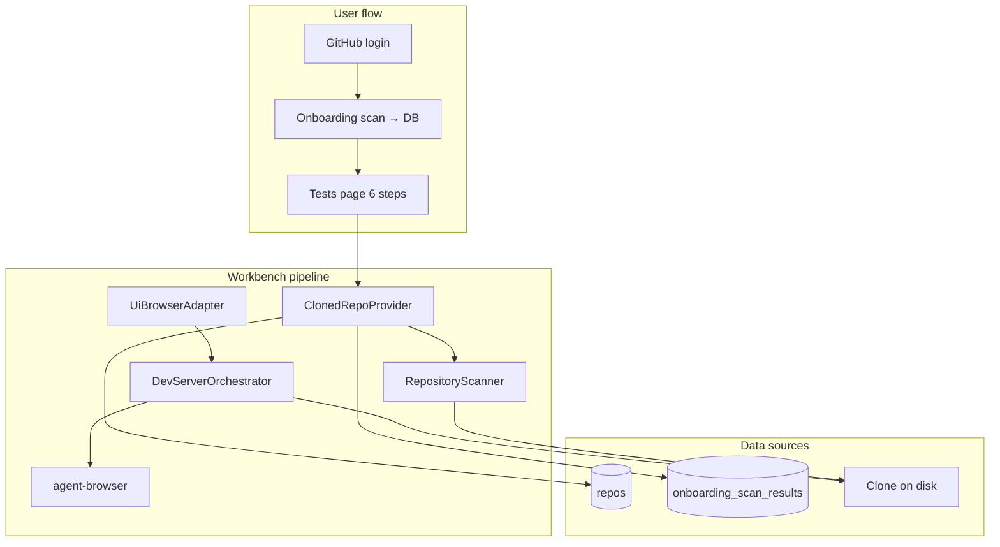
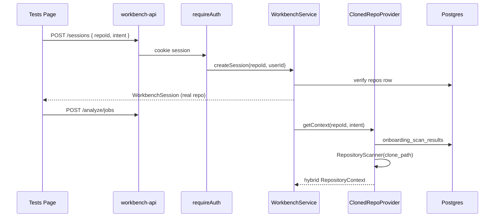
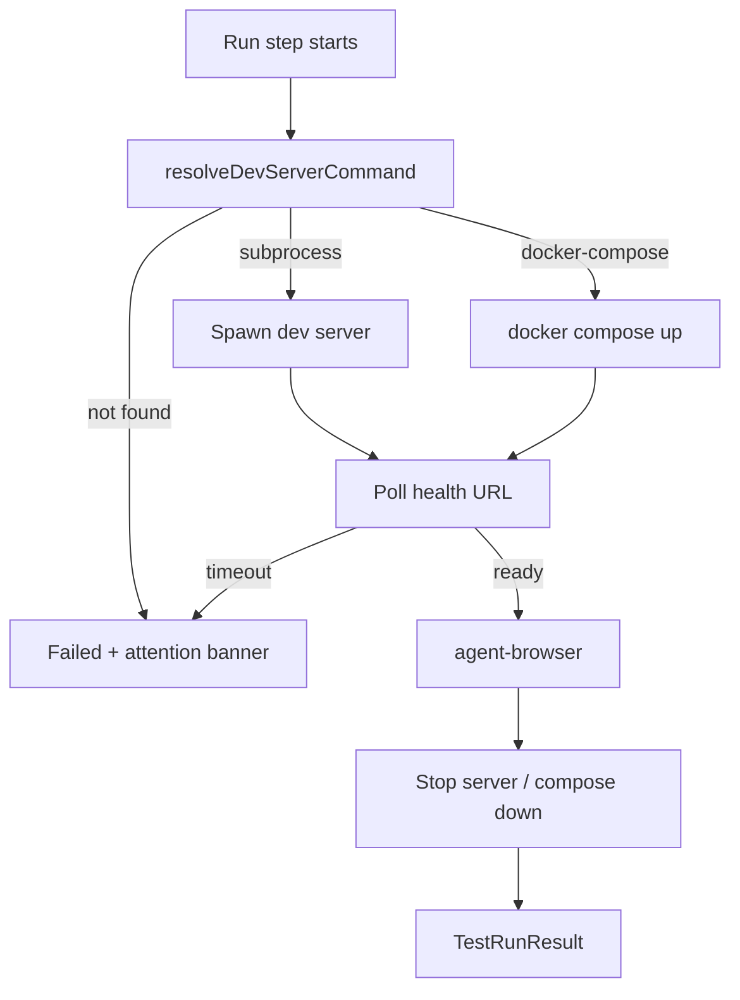

# Real Workbench User Repository Integration Design

**Date:** 2026-06-13  
**Topic:** Wire the Tests page workbench to authenticated user repos, onboarding scan data, and live dev-server + agent-browser runs  
**Status:** Approved design

## 1. Problem

The Tests page (`/tests`) workbench pipeline is skill-driven and can run UI Browser steps with `agent-browser`, but it still operates on a **local Guardrail shortcut**:

- Workbench sessions hardcode `repo: guardrail`
- `LocalGuardrailRepositoryProvider` only accepts `guardrail` / `local` and scans the Guardrail checkout
- QC cases and frontend URLs are seeded/hardcoded
- Workbench routes have no auth; `repoId` from the frontend is ignored
- Run step opens a fixed `http://127.0.0.1:5173/onboarding` URL

Meanwhile, the rest of the product is real:

- GitHub OAuth and cloned repos in `repos` (`clone_path`, branch, commit)
- Onboarding scan persisted in `onboarding_scan_results` (`summary`, `logs`, `dashboard_payload`)
- Dashboard reads scan data via `GET /api/repos/:repoId/dashboard`
- Frontend tracks the active repo in `localStorage` (`tl.activeRepoId`)

The Tests page must use the **same user's repository and onboarding evidence**, not mock or local-only context.

## 2. Goal

For **UI / Browser** tests only, connect the six-step workbench to:

1. The authenticated user's cloned GitHub repository
2. Hybrid context: onboarding DB payload + live file scan on `clone_path`
3. A managed dev server (subprocess first; Docker when compose is detected)
4. Real `agent-browser` evidence against that running app
5. Clear Run-step errors when the dev server cannot be started or detected

Steps 1–4 and 6 continue to use markdown skills + structured model outputs. Step 5 adds dev-server orchestration before browser automation.

## 3. Product principles

- **Mock missing integrations, not product truth.** No hardcoded onboarding classifications or coupon/checkout dummy data in normal runtime.
- **Hybrid evidence.** DB for stable product context (QC, test inventory, coverage); live scan for current files/snippets.
- **Fail clearly.** If the dev server cannot start or is undetectable, the Run step fails with an actionable message — no fake Passed outcome or placeholder screenshots.
- **Reuse existing patterns.** Extend `RepositoryContextProvider` and the adapter model; do not replace the workbench job/SSE architecture.
- **Localhost only.** Dev servers bind `127.0.0.1`; teardown on job end, abort, or timeout.

## 4. Scope

### In scope

- `ClonedRepoRepositoryProvider` (DB repo + hybrid onboarding/live scan)
- Auth on all `/api/workbench/*` routes
- Session bound to real `repoId` from onboarding
- Isolation / Plan / Generate / Review using real clone + DB context
- Run: subprocess dev server → health wait → `agent-browser` → teardown
- Docker Run tier when `docker-compose.yml` is detected (fallback to subprocess)
- Frontend `workbench-api`: `credentials: 'include'`, require active repo, no silent mock fallback in real mode
- Clear Run-step failure UX when dev server cannot start

### Out of scope

- Unit / Mobile / other test-type adapters
- Applying generated tests to the clone or creating PRs
- Re-running onboarding scan from the Tests page
- Persisting workbench sessions to the database
- Auto `pnpm install` during Run
- Model-driven `test-run-ui-browser` skill (keep `fallbackRunPlanFromScenario` for now)
- Switching repo mid-workflow

## 5. Architecture overview



## 6. Repository context (hybrid — Approach C)

### `ClonedRepoRepositoryProvider`

Replace production use of `LocalGuardrailRepositoryProvider` with a provider that:

1. Loads `repos` row for `(repoId, userId)` — error if missing or not cloned
2. Loads `onboarding_scan_results.dashboard_payload` when present
3. Runs `RepositoryScanner` on `clone_path` with the session intent
4. Merges into `RepositoryContext`

### Context shape

```ts
RepositoryContext {
  repo: RepoRef                    // from repos (name, path=clone_path, branch, commit)
  relatedFiles                    // live scanner: ranked source + test files
  sourceSnippets                  // live scanner: bounded snippets
  specDocs                        // live scanner: docs/ markdown in clone
  qcCases                         // from dashboard_payload QC preview
  onboarding: {                   // NEW — from DB (empty if no scan row)
    testCases,
    insights,
    coverage,
    health,
    lastScanAt,
  }
  frontend: {                     // hints; fully resolved at Run step
    startCommand?: string
    healthUrl?: string
    url?: string
    route?: string
  }
}
```

### Hybrid rules

| Source | Used for |
|--------|----------|
| **DB (`onboarding_scan_results`)** | QC cases, test case inventory, coverage %, health score, insights |
| **Live scan (`RepositoryScanner`)** | File paths, snippets, spec docs in clone |
| **Missing onboarding row** | Proceed with live scan only; `onboarding` empty — do not fail |

`LocalGuardrailRepositoryProvider` remains for unit tests only.

## 7. Auth, routes & service wiring

### Authenticated workbench routes

Add `requireAuth` to `/api/workbench/*`, matching onboarding/repos.

**`POST /api/workbench/sessions`**

```ts
Body: { repoId: string, intent?: Partial<IntentInput> }
```

Flow:

1. Validate cookie session
2. `ReposRepository.getForUser(repoId, userId)` — 404 if not found
3. Require `status === 'cloned'` and `clone_path` — 422 otherwise
4. Create session with real `RepoRef` from the DB row
5. Store `repoId` on the session for provider lookups

Job routes (`analyze`, `plan`, `generate`, `run`, `review`) keep the same URLs; service resolves repo from session.

### Service changes

| Component | Change |
|-----------|--------|
| `workbench/index.ts` | Wire `ClonedRepoRepositoryProvider` in production |
| `WorkbenchService` | Pass `userId` + `repoId` into `getContext()` |
| `job-store.ts` | Remove `DEFAULT_REPO`; session created with real repo |
| `UiBrowserAdapter` analyze/plan | Pass `onboarding` slice in model `context` |

### Frontend seam

`workbench-api.ts`:

- `credentials: 'include'` on all requests
- Require `getActiveRepoId()` — error: *"Complete onboarding and select a repository first"*
- Remove `repoId ?? 'mock'` fallback in real mode
- Mock only when `VITE_WORKBENCH_USE_MOCK=true`

`GenerateTestsPage` / `useWorkbench`: surface 401 (redirect to login); show repo name from `session.repo.name`.



## 8. Dev server orchestration + Run step

New component: **`DevServerOrchestrator`** — used only in `UiBrowserAdapter.run()`.

### Dev command resolution

`resolveDevServerCommand(clonePath)` — extend onboarding `repo-scan-analyzer` patterns:

| Priority | Location | Script | Example |
|----------|----------|--------|---------|
| 1 | `frontend/package.json` | `dev` | `pnpm --dir frontend dev --host 127.0.0.1 --port {port}` |
| 2 | Root `package.json` | `dev` | `pnpm dev --host 127.0.0.1 --port {port}` |
| 3 | Root | `start` (no `dev`) | `npm start` |
| 4 | `docker-compose.yml` | web/frontend/app service | Docker tier |
| 5 | — | none | **fail** with clear error |

Reuse `detectPackageManager()`. Port is ephemeral (`127.0.0.1`, OS-assigned or high port range).

**Route resolution:** parse generated scenario for paths; fallback `/`.

### Execution tiers



**Tier 1 — Subprocess (ship first)**

- `spawn(devCommand, { cwd, env: { PORT } })`
- Poll `GET http://127.0.0.1:{port}/` until 200 (max 60s, configurable)
- Run `agent-browser` against `http://127.0.0.1:{port}{route}`
- `finally`: SIGTERM → SIGKILL; progress events throughout

**Tier 2 — Docker (when compose detected)**

- `docker compose -f {file} up -d {service}` with project name `guardrail-wb-{sessionId}`
- Map published port to health URL
- `docker compose down` in `finally`
- If Docker unavailable: fallback to Tier 1 when subprocess command exists; else fail

### Run step flow (updated)

```
1. devTarget = orchestrator.resolve(clonePath) — fail if unresolvable
2. lease = await orchestrator.start(devTarget, signal)
3. runPlan = fallbackRunPlanFromScenario(scenarioText) — paths against lease.baseUrl
4. runnerResult = await agent-browser(runPlan)
5. finally: orchestrator.stop(lease)
```

### Run-step errors

| Condition | Outcome | User message |
|-----------|---------|--------------|
| No dev script / compose | `Failed` | Could not determine how to start dev server |
| Health timeout | `Failed` | Dev server did not become ready within 60s |
| Spawn crash | `Failed` | stderr excerpt in `attention.reason` |
| agent-browser failure | `Failed` | existing attention flow |
| Job aborted | `AbortError` | teardown in `finally` |

Job status `failed`; Run step shows attention banner. No fake screenshots or Passed.

### Safety

- Bind `127.0.0.1` only
- One dev server lease per session
- Teardown on job timeout (`WORKBENCH_STEP_TIMEOUT_MS`)
- No auto `pnpm install` during Run (fail if `node_modules` missing)

### New files

| File | Role |
|------|------|
| `dev-server/dev-server-resolver.ts` | Detect command, port, route, docker vs subprocess |
| `dev-server/dev-server-orchestrator.ts` | start / stop / health poll |
| `dev-server/dev-server-orchestrator.test.ts` | resolver + lifecycle tests |
| `repositories/cloned-repo-repository-provider.ts` | Hybrid DB + scanner provider |
| `ui-browser.adapter.ts` | Wire orchestrator into `#runUi` |

Optional env: `WORKBENCH_DEV_SERVER_TIMEOUT_MS`, `WORKBENCH_USE_DOCKER=auto|always|never`.

## 9. Testing strategy

| Layer | Coverage |
|-------|----------|
| `ClonedRepoRepositoryProvider` | DB payload + scanner merge; wrong user 404; empty onboarding |
| `DevServerResolver` | frontend dev, root dev, compose; null when unknown |
| `DevServerOrchestrator` | Mock spawn: health success/timeout; teardown on abort |
| `UiBrowserAdapter.run` | Fake orchestrator: assert start → browser → stop order |
| `workbench.routes.test` | Auth required; real repo session; Run failure in snapshot |
| `workbench-api` | Active repo required; credentials sent |

## 10. Rollout

1. Backend: `ClonedRepoRepositoryProvider` + auth + session binding (steps 2–4 on real data)
2. Backend: dev server orchestrator + Run wiring
3. Frontend: credentials + active repo required
4. Manual smoke: login → onboard → Tests → full UI Browser flow on real clone

No new DB migration. Reuses `repos` and `onboarding_scan_results`.

## 11. Related docs

- [Test page architecture](../../test-page-architecture.md)
- [Real workbench skill pipeline design](./2026-06-13-real-workbench-skill-pipeline-design.md)
- [Workbench evidence streaming design](./2026-06-13-workbench-evidence-streaming-design.md)
