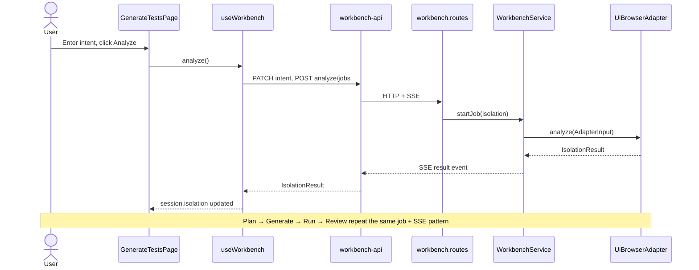
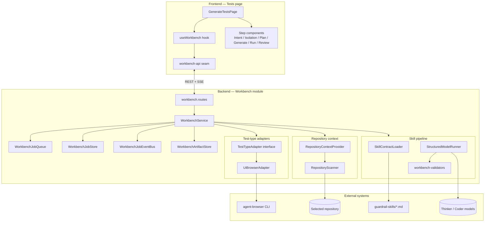
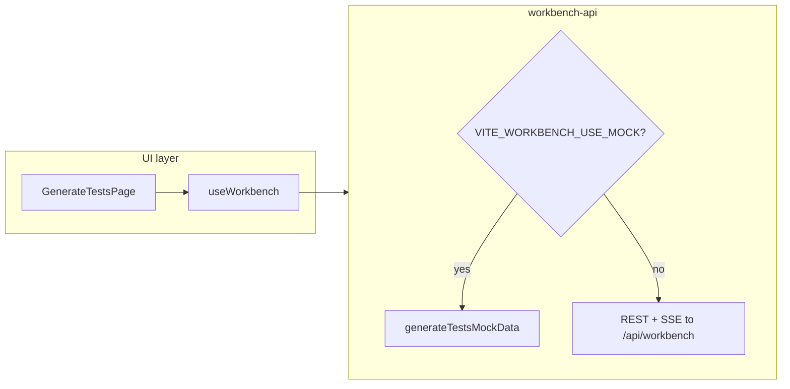
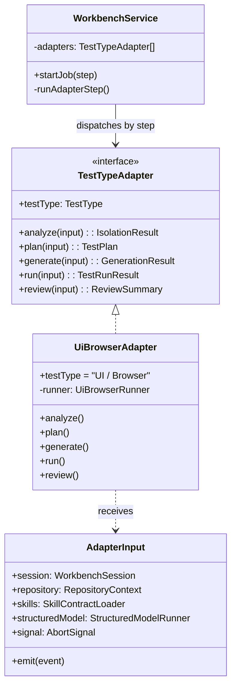
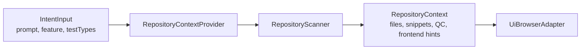
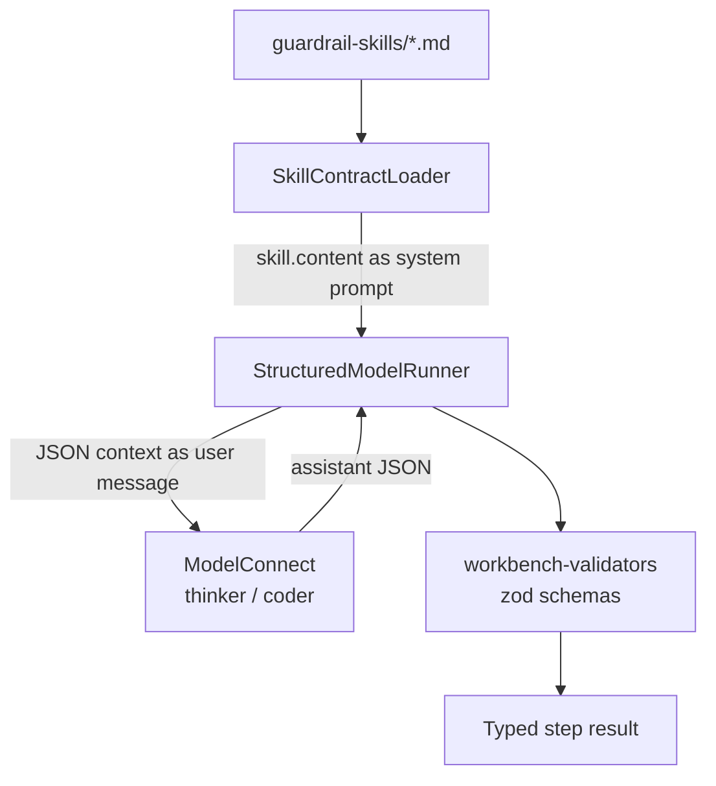
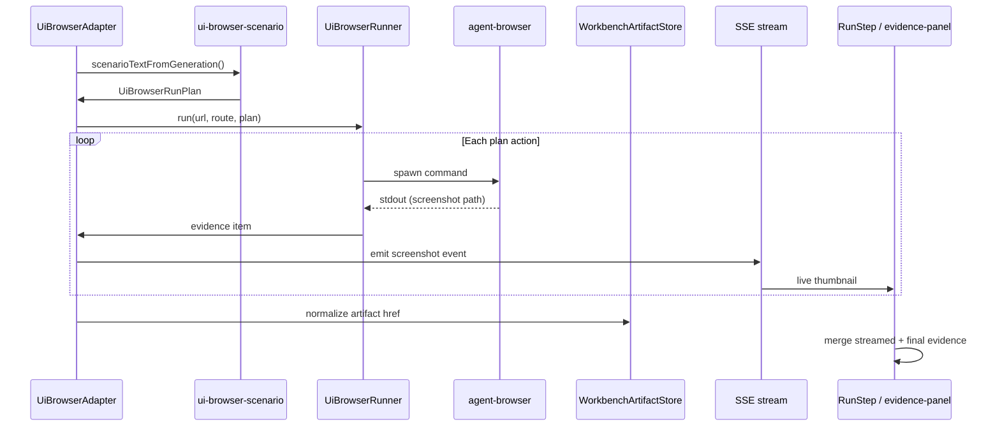

# Test Page Architecture

**Page:** `/tests` (`GenerateTestsPage`)  
**Purpose:** Guide a developer through a six-step, evidence-based workflow to understand testing gaps, plan improvements, generate tests, run them, and review results before applying changes.

This document describes how the Tests page is structured — the abstractions, the adapter pattern, the skill-driven pipeline, and how frontend and backend stay aligned through shared contracts.

---

## 1. Mental model

Guardrail treats four sources of truth as inputs to every workbench step:

| Source | Role in the Tests page |
|--------|------------------------|
| **Code** | Repository scanner finds source files, existing tests, and bounded snippets |
| **Specs** | Product docs under `docs/` and `guardrail-skills/` |
| **QC cases** | Seeded or discovered manual test cases in repository context |
| **Test runs** | Real `agent-browser` execution produces screenshots and run outcomes |

The Tests page does not embed testing intelligence in the UI. It **orchestrates** a workflow and **renders** structured results returned by the backend. Reasoning, generation, and browser execution live behind a stable API seam.

---

## 2. Six-step workflow

The page walks through six steps. Step 1 (Intent) is edited in the UI; steps 2–6 are long-running backend jobs.

| Step | ID | Who drives it | Output contract |
|------|----|---------------|-----------------|
| 1 | `intent` | Frontend (user input) | `IntentInput` stored on session |
| 2 | `isolation` | Backend job (`analyze`) | `IsolationResult` |
| 3 | `plan` | Backend job (`plan`) | `TestPlan` |
| 4 | `generate` | Backend job (`generate`) | `GenerationResult` |
| 5 | `run` | Backend job (`run`) | `TestRunResult` |
| 6 | `review` | Backend job (`review`) | `ReviewSummary` |

Each backend step is **job-based**: the client POSTs to start a job, then subscribes to an SSE event stream until a `result` or `error` event arrives.



---

## 3. Layered architecture (high level)



---

## 4. Frontend architecture

### 4.1 Page shell

`GenerateTestsPage` is a thin shell. It:

- Loads or creates a workbench session on mount
- Renders the workflow sidebar and the active step component
- Delegates all state transitions to `useWorkbench`
- Merges streamed run evidence with final `session.run` for the evidence panel

Step components (`IntentStep`, `IsolationStep`, `PlanStep`, etc.) are **presentational**. They receive session slices and callbacks; they do not call the backend directly.

### 4.2 `useWorkbench` — workflow controller

The hook owns:

- Session lifecycle (`loading` → `ready` / `error`)
- Current step index and pending transition state
- Step transitions: `analyze`, `generatePlan`, `approvePlan`, `runTests`
- Run-time UX: progress events, screenshot evidence stream, generation/run animations

It never branches on mock vs real. Both paths go through `workbench-api`.

### 4.3 `workbench-api` — the seam

`frontend/src/data/workbench-api.ts` is the **single integration boundary** between UI and backend.

| Responsibility | Detail |
|----------------|--------|
| Session CRUD | `createWorkbenchSession`, `updateWorkbenchIntent` |
| Job execution | `analyzeSession`, `planSession`, `generateSession`, `runSession`, `reviewSession` |
| Streaming | `EventSource` on `/jobs/:jobId/events` |
| Artifact URLs | Normalizes relative `/api/workbench/.../artifacts/...` hrefs to absolute URLs |
| Mock toggle | `VITE_WORKBENCH_USE_MOCK=true` returns slices from `generateTestsMockData` |

This seam lets the page ship with mock data for design review while defaulting to the real backend for evidence-based runs.



---

## 5. Backend architecture

### 5.1 Routes — HTTP + SSE surface

`workbench.routes.ts` exposes a small REST API:

| Method | Path | Action |
|--------|------|--------|
| `POST` | `/sessions` | Create session |
| `PATCH` | `/:sessionId` | Update intent |
| `POST` | `/:sessionId/analyze/jobs` | Start isolation job |
| `POST` | `/:sessionId/plan/jobs` | Start plan job |
| `POST` | `/:sessionId/generate/jobs` | Start generate job (optional approval body) |
| `POST` | `/:sessionId/run/jobs` | Start run job |
| `POST` | `/:sessionId/review/jobs` | Start review job |
| `GET` | `/:sessionId/jobs/:jobId` | Job snapshot + replay events |
| `GET` | `/:sessionId/jobs/:jobId/events` | SSE stream |
| `GET` | `/:sessionId/artifacts/:artifactId` | Serve screenshot/trace files |

Routes stay thin. They validate params, call `WorkbenchService`, and format SSE.

### 5.2 `WorkbenchService` — orchestrator

`WorkbenchService` coordinates everything for each job:

1. Load current session from `WorkbenchJobStore`
2. Resolve repository context via `RepositoryContextProvider` (intent-aware)
3. Build `AdapterInput` (session, repository, skills, structured model, emit callback, abort signal)
4. Dispatch to the correct `TestTypeAdapter` method for the step
5. Persist step result on the session
6. Emit `result` over SSE; normalize artifact hrefs through `WorkbenchArtifactStore`

The service is **test-type agnostic** at the interface level. Today it requires a UI Browser adapter, but the constructor accepts `TestTypeAdapter[]` so additional adapters (Unit, Mobile, etc.) can register without changing the job model.

### 5.3 Job infrastructure

| Component | Role |
|-----------|------|
| `WorkbenchJobQueue` | Runs jobs with concurrency limits, timeouts, and abort signals |
| `WorkbenchJobStore` | In-memory sessions, jobs, events, and per-step results |
| `WorkbenchJobEventBus` | Pub/sub for live SSE subscribers |
| `WorkbenchArtifactStore` | Copies screenshot files into a served artifact directory |

Job events share one vocabulary with the frontend `JobEvent` type: `status`, `progress`, `thinking`, `screenshot`, `artifact`, `result`, `error`.

---

## 6. The adapter pattern

### 6.1 Why adapters exist

Different test types need different analysis, generation, and execution strategies:

- **UI / Browser** — skill-driven model steps + `agent-browser` runs
- **Unit** (future) — file edits + test runner commands
- **Mobile** (future) — simulator orchestration

The workbench workflow is identical for all types (six steps, same schemas). Only the **adapter implementation** changes per test type.

### 6.2 `TestTypeAdapter` interface

Defined in `backend/src/modules/workbench/adapters/test-type-adapter.ts`:

```ts
interface TestTypeAdapter {
  readonly testType: TestType;
  analyze(input: AdapterInput): Promise<IsolationResult>;
  plan(input: AdapterInput & { isolation: IsolationResult }): Promise<TestPlan>;
  generate(input: AdapterInput & { plan: TestPlan; approval: PlanApproval }): Promise<GenerationResult>;
  run(input: AdapterInput & { generation: GenerationResult }): Promise<TestRunResult>;
  review(input: AdapterInput & { generation: GenerationResult; run: TestRunResult }): Promise<ReviewSummary>;
}
```

`AdapterInput` is the **dependency injection bundle** passed into every adapter method:

| Field | Purpose |
|-------|---------|
| `session` | Current workbench session and intent |
| `repository` | Scanned repo context (files, snippets, QC, frontend hints) |
| `skills` | Loads markdown skill contracts from `guardrail-skills/` |
| `structuredModel` | Runs thinker/coder with skill + JSON schema validation |
| `modelConnect` | Low-level LLM client access (legacy escape hatch) |
| `emit` | Push progress/screenshot events to the job stream |
| `signal` | Cooperative cancellation |



### 6.3 `UiBrowserAdapter` — current implementation

`UiBrowserAdapter` implements the full pipeline for UI Browser tests:

| Step | Skill file | Model profile | Schema |
|------|------------|---------------|--------|
| `analyze` | `test-isolation-files.md` | thinker | `IsolationResult` |
| `plan` | `test-plan.md` | thinker | `TestPlan` |
| `generate` | `test-generate-ui-browser.md` | coder | `GenerationResult` |
| `review` | `test-review.md` | thinker | `ReviewSummary` |

`generate` short-circuits to a no-op result when approval is `cancel`, `skipUiTests`, or `unitTestsOnly` — without calling the model.

`run` is **not** model-driven today. It:

1. Extracts scenario text from generated diffs (`scenarioTextFromGeneration`)
2. Builds a bounded browser action plan (`fallbackRunPlanFromScenario`)
3. Executes commands via `UiBrowserRunner` → `agent-browser`
4. Streams screenshot events through `emit` as commands complete

---

## 7. Repository context abstraction

Repository access is behind `RepositoryContextProvider`:

```ts
interface RepositoryContextProvider {
  getContext(repoId: string, intent?: IntentInput): Promise<RepositoryContext>;
}
```

The local implementation (`LocalGuardrailRepositoryProvider`) delegates to `RepositoryScanner`, which:

- Inventories files with `rg --files`
- Ranks source, test, and spec files by intent tokens
- Extracts bounded source snippets (line + char limits)
- Attaches frontend dev URL hints for browser runs
- Returns seeded QC cases where automation is missing

This keeps adapters free of filesystem logic. They receive a ready-made `RepositoryContext` on every job.



---

## 8. Skill-driven model pipeline

Product behavior instructions live in **markdown skill contracts** under `guardrail-skills/`. TypeScript owns loading, invocation, and validation.



`StructuredModelRunner.runStep`:

1. Refuses to run if `ModelConnect` is null (clear configuration error)
2. Sends skill content as the system message
3. Sends `{ schemaName, context }` as the user message
4. Parses JSON (supports fenced code blocks)
5. Validates against the matching zod schema (`IsolationResult`, `TestPlan`, etc.)
6. Returns a typed object stored on the session

Skills are editable without TypeScript changes. Validators ensure the UI always receives schema-shaped data.

---

## 9. Run step and evidence streaming

The Run step is where deterministic tooling meets the UI. Evidence must be real, not placeholder URLs.



| Stage | What the user sees |
|-------|-------------------|
| During run | Progress messages and screenshot thumbnails via SSE |
| After run | `TestRunResult` matrix, coverage placeholders, attention banner on failure |
| Review | Recommendation grounded in generated changes and run evidence |

---

## 10. Shared contracts

Frontend and backend share one schema vocabulary. The backend file `workbench.types.ts` mirrors `frontend/design/testlens-schemas.ts` (and `frontend/src/types/testlens.ts`).

Key types:

- `WorkbenchSession` — accumulates `intent`, `isolation`, `plan`, `generation`, `run`, `review` across steps
- `IsolationResult` — classified behaviors, gaps, user journeys
- `TestPlan` — proposed actions, risk flags, files to change, questions
- `GenerationResult` — staged changes with diffs and timeline
- `TestRunResult` — unit/ui/mobile outcomes, evidence, matrix
- `ReviewSummary` — counts, remaining risk, recommendation

No translation layer sits between API and UI. A validated backend payload renders directly in step components.

---

## 11. Extension points

The architecture is designed for incremental expansion:

| Extension | How to add it |
|-----------|---------------|
| New test type | Implement `TestTypeAdapter`, register in `WorkbenchService` adapters array |
| New repository source | Implement `RepositoryContextProvider` (e.g. GitHub clone) |
| New workbench step | Add to `WorkflowStepId`, route, service dispatch, frontend step component |
| Richer browser planning | Replace `fallbackRunPlanFromScenario` with model-driven `test-run-ui-browser` skill |
| Persistent sessions | Swap `WorkbenchJobStore` for a database-backed implementation without changing routes |

---

## 12. Key files

### Frontend

| File | Role |
|------|------|
| `frontend/src/pages/GenerateTestsPage.tsx` | Page shell and step routing |
| `frontend/src/pages/generate-tests/use-workbench.ts` | Workflow state machine |
| `frontend/src/data/workbench-api.ts` | API seam (mock + real) |
| `frontend/src/pages/generate-tests/steps/*.tsx` | Per-step UI |
| `frontend/src/pages/generate-tests/evidence-panel.tsx` | Screenshot/evidence display |

### Backend

| File | Role |
|------|------|
| `backend/src/modules/workbench/workbench.routes.ts` | HTTP + SSE endpoints |
| `backend/src/modules/workbench/workbench.service.ts` | Job orchestration |
| `backend/src/modules/workbench/adapters/test-type-adapter.ts` | Adapter interface |
| `backend/src/modules/workbench/adapters/ui-browser/ui-browser.adapter.ts` | UI Browser implementation |
| `backend/src/modules/workbench/repositories/repository-scanner.ts` | Repo file discovery |
| `backend/src/modules/workbench/skills/skill-contract-loader.ts` | Markdown skill loading |
| `backend/src/modules/workbench/model/structured-model-runner.ts` | LLM + JSON validation |
| `backend/src/modules/workbench/validation/workbench-validators.ts` | zod schemas |
| `guardrail-skills/*.md` | Product-owned step instructions |

### Related design docs

- `docs/superpowers/specs/2026-06-13-real-workbench-skill-pipeline-design.md` — pipeline design rationale
- `docs/superpowers/specs/2026-06-13-workbench-evidence-streaming-design.md` — SSE evidence details
- `docs/superpowers/specs/2026-06-12-ui-browser-workbench-backend-design.md` — original backend slice

---

## 13. Design principles (summary)

1. **UI orchestrates, backend reasons** — the Tests page renders contracts; adapters and models produce them.
2. **Adapter per test type** — shared six-step workflow, pluggable execution strategy.
3. **Skills for product logic** — markdown instructions separate from TypeScript infrastructure.
4. **Validate before store** — every model output passes zod validation before entering session state.
5. **Evidence over assertion** — run outcomes require real `agent-browser` screenshots, streamed live when possible.
6. **One seam, two modes** — `workbench-api` supports mock and real backends without forking the hook or page.
